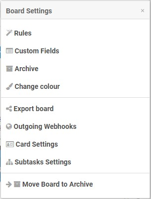
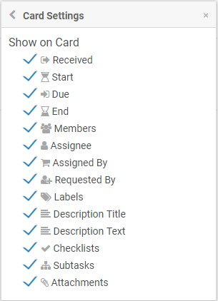
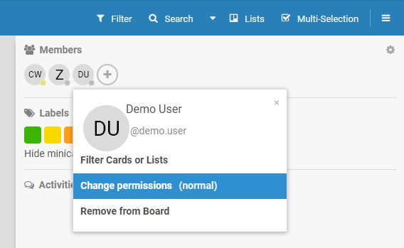
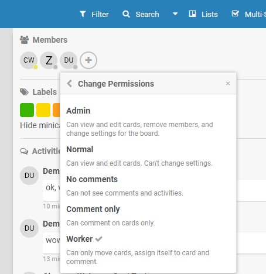

## Board Settings, Administration and Customization

There are different user roles for every board:
* **Admin** (at default the user who created the board in the first place)
* **Normal** (at default every invited user)
* No comments
* Comment only
* Worker

### Board Settings
Board settings can only be changed by **board admins** (not to be confused with Wekan admins!). By pressing `W` or clicking on the top right menu (`≡`) to open the board settings side pane and afterwards clicking the ⚙️-icon in the board side pane, they can edit:
* Board name and description, whether it is a public or a private board, board members
* Lists (add, rename, remove) and swimlanes (add, rename, remove)
* Board theme ("color")
* Board settings (rules, fields, card settings, subtask settings etc.)

If you want to simplify the cards on your board — e. g. you want your cards to have no more than a title, an assignee, labels, a due date and the comment section — you can untick some of the boxes in *board settings > card settings*:

### User roles
**Normal users** can view and edit all cards, but not board settings.

**No comments users** cannot see comments and activities, but they can edit cards.

**Comment only users** can see all comments and activities of the cards, can comment on cards, but cannot edit or move them.

**Worker** can move cards, assign him/herself to cards and can comment on cards. workers cannot change card properties like labels, dates, the title, the description or subtasks, though.

#### Change user roles
Only board admins can change the board's members and their roles. To change a user role:

*Board settings* (`≡`) *> Click on board user icon (initials) > Change permissions*

### Related Topics (Advanced)
* [Templates](Templates.md)
* [Custom Fields](Custom-Fields.md)
* [Swimlanes](Swimlanes.md)
* [Subtasks](Subtasks.md)
